# OpsMonitor 服务监控系统 — 用户使用手册

> **版本**: 2.2.0
> **更新日期**: 2026-03-11
> **适用范围**: OpsMonitor 服务监控系统（前端端口: 5173，后端端口: 3000）

---

## 目录

1. [第一章：系统概述](#第一章系统概述)
2. [第二章：部署与安装](#第二章部署与安装)
3. [第三章：快速入门](#第三章快速入门)
4. [第四章：用户认证](#第四章用户认证)
5. [第五章：概览仪表盘](#第五章概览仪表盘)
6. [第六章：项目管理](#第六章项目管理)
7. [第七章：主机管理](#第七章主机管理)
8. [第八章：服务管理](#第八章服务管理)
9. [第九章：调度配置](#第九章调度配置)
10. [第十章：依赖拓扑图](#第十章依赖拓扑图)
11. [第十一章：告警配置](#第十一章告警配置)
12. [第十二章：安全配置](#第十二章安全配置)
13. [第十三章：Grafana 集成](#第十三章grafana-集成)
14. [第十四章：系统设置（仅管理员）](#第十四章系统设置仅管理员)
15. [第十五章：用户管理（仅管理员）](#第十五章用户管理仅管理员)
16. [第十六章：健康检查类型参考](#第十六章健康检查类型参考)
17. [第十七章：典型使用场景](#第十七章典型使用场景)
18. [第十八章：常见问题与故障排查](#第十八章常见问题与故障排查)
- [附录 A：API 接口速查表](#附录-aapi-接口速查表)
- [附录 B：快捷键说明](#附录-b快捷键说明)

---

## 第一章：系统概述

### 1.1 系统简介

OpsMonitor 是一套面向团队和中小型项目的全栈服务监控系统，采用现代化架构设计，提供全方位的服务健康监控、依赖关系可视化与智能告警能力。系统同时支持本地和远程（SSH）双模式部署，适用于多项目的生产环境运维场景。

**核心功能亮点**：

| 功能 | 说明 |
|------|------|
| 🏗️ **三层架构管理** | 项目 → 主机 → 服务的层级化组织方式 |
| 🔍 **多种健康检查** | TCP、HTTP/HTTPS、自定义脚本、文件监控（本地及 SSH 远程） |
| 📊 **依赖可视化** | 交互式服务拓扑图，支持影响分析与依赖追踪 |
| 🔔 **智能告警通知** | 支持邮件（SMTP）和 Teams Webhook，可自定义告警规则与阈值 |
| 📈 **Grafana 集成** | 嵌入外部 Grafana 仪表板，统一展示 |
| 🔐 **安全管理** | AccessKey、SSL 证书、密码的过期监控与提醒 |
| 🔄 **动态调度** | 灵活的定时检查配置，支持时间范围限制 |
| 🌍 **多语言支持** | 中英文界面一键切换，告警通知语言自动同步 |

### 1.2 系统架构

OpsMonitor 采用前后端分离架构，配合嵌入式数据库，实现开箱即用：

```
┌─────────────────────────────────────────────────────────────────┐
│                       OpsMonitor                                │
├──────────────────────────────┬──────────────────────────────────┤
│   前端 (Vue 3 + Element Plus)│   后端 (Node.js + Express)      │
│      端口: 5173              │      端口: 3000                  │
├──────────────────────────────┴──────────────────────────────────┤
│                     SQLite 嵌入式数据库                          │
└─────────────────────────────────────────────────────────────────┘
```

**三层管理架构**：

```
项目（Project）
  └── 主机（Host）          ← 配置 SSH 或 Local 连接
        └── 服务（Service） ← 配置健康检查类型和调度
```

- **项目**：业务或环境的逻辑分组，例如"生产环境"、"开发环境"
- **主机**：实际的服务器或目标机器，包含连接配置
- **服务**：具体的监控项，每个服务对应一种健康检查

### 1.3 用户角色与权限

系统提供两种用户角色：

| 角色 | 英文标识 | 权限范围 |
|------|---------|---------|
| **管理员** | Admin | 完整权限：项目/主机/服务的增删改查、告警与安全配置、用户管理、系统设置 |
| **观察者** | Viewer | 只读权限：查看监控数据、仪表盘；可手动触发健康检查，不可修改任何配置 |

> 新注册账号默认角色为 **Viewer**，需由管理员手动升级为 Admin。

### 1.4 技术栈概览

| 层次 | 技术组件 |
|------|---------|
| **前端** | Vue 3 · TypeScript · Element Plus · ECharts · Pinia · Axios · vue-i18n |
| **后端** | Node.js · Express · TypeScript · JWT · node-cron |
| **数据库** | SQLite（嵌入式，无需独立部署） |
| **远程通信** | ssh2（SSH 连接池） |
| **容器化** | Docker + Docker Compose |

---

## 第二章：部署与安装

### 2.1 环境要求

| 组件 | 最低版本 | 说明 |
|------|---------|------|
| Node.js | 18.0+ | 本地开发必需 |
| npm | 随 Node.js | 包管理器 |
| Docker | 20.10+ | 生产部署时使用 |
| Docker Compose | v2.0+ | 生产部署时使用 |
| 操作系统 | Windows / Linux / macOS | 均支持 |

### 2.2 本地开发启动

**方式一：使用快速启动脚本（推荐）**

```powershell
# Windows (PowerShell)
cd OpsMonitor
.\dev.ps1
```

```bash
# Linux / macOS
cd OpsMonitor
./dev.sh
```

**方式二：手动启动**

```bash
# 终端 1：启动后端 (端口 3000)
cd OpsMonitor/backend
npm install
npm run dev

# 终端 2：启动前端 (端口 5173)
cd OpsMonitor/frontend
npm install
npm run dev
```

### 2.3 生产环境 Docker 部署

```bash
cd OpsMonitor
docker compose up -d
```

Docker 将自动完成前后端构建与启动，**无需手动执行 `npm run build`**。

| 服务 | 端口 | 说明 |
|------|------|------|
| 前端 | 5173 | Nginx 静态服务 + API 代理 |
| 后端 | 3000 | Express API 服务 |
| 数据库 | — | SQLite 文件，持久化到 `/opt/OpsMonitor/backend/data` |

### 2.4 环境变量配置

**所有部署方式均无需创建任何配置文件**，项目已内置全部默认值，开箱即用。

仅当需要覆盖默认值时，可在 `backend/` 目录创建 `.env` 文件：

```env
NODE_ENV=development
PORT=3000
DB_PATH=./data/monitor.db
JWT_SECRET=your-secret-key-here
```

| 变量 | 默认值 | 说明 |
|------|--------|------|
| `NODE_ENV` | `production` | 运行模式 |
| `PORT` | `3000` | 后端监听端口 |
| `DB_PATH` | `/app/data/monitor.db` | SQLite 数据库文件路径 |
| `JWT_SECRET` | `opsmonitor-secret-key-change-in-production` | JWT 签名密钥，**生产环境务必替换** |

### 2.5 访问地址

| 地址 | 说明 |
|------|------|
| `http://localhost:5173` | 前端用户界面 |
| `http://localhost:3000/health` | 后端健康检查接口 |
| `http://localhost:3000/api` | 后端 API 前缀（需跟具体路径） |

---

## 第三章：快速入门

### 3.1 完整使用流程

```
登录系统（默认账号 admin / admin123）
    ↓
创建项目（组织服务的逻辑分组）
    ↓
添加主机（配置 SSH 或 Local 连接信息）
    ↓
添加服务（选择检查类型，关联主机，配置调度）
    ↓
启用监控（确认服务的 Monitoring 开关已开启）
    ↓
查看仪表盘（概览所有服务的健康状态）
    ↓
配置告警（设置邮件 / Teams 通知渠道）
    ↓
查看依赖图（分析服务拓扑与影响范围）
```

### 3.2 五分钟快速上手

**Step 1** — 登录系统，使用默认账号 `admin` / `admin123`

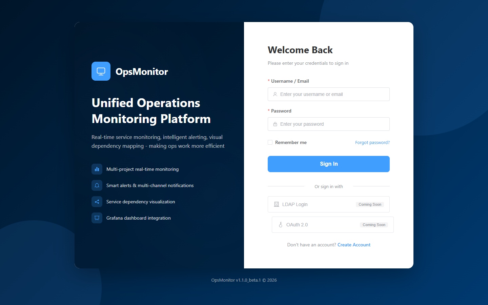

**Step 2** — 点击左侧导航栏 **INFRASTRUCTURE → Projects**，点击 **New Project** 创建第一个项目

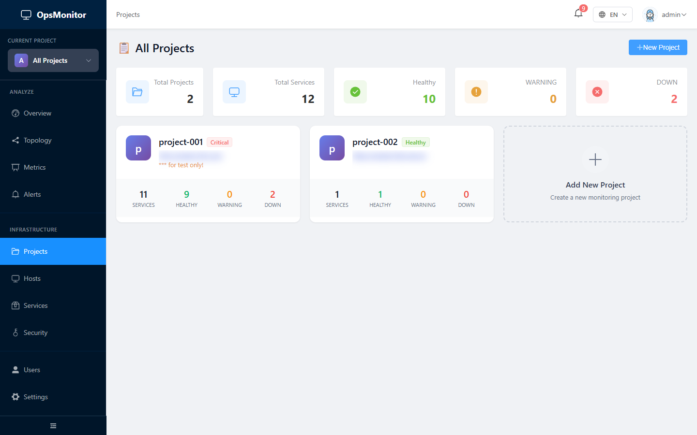

**Step 3** — 进入 **Hosts** 页面，点击 **Add Host** 添加目标服务器

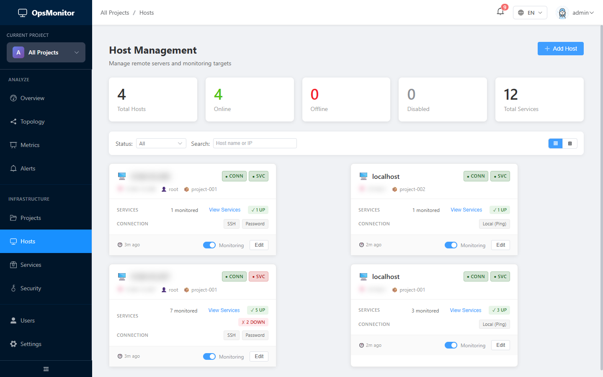

**Step 4** — 进入 **Services** 页面，点击 **Add Service** 添加监控服务

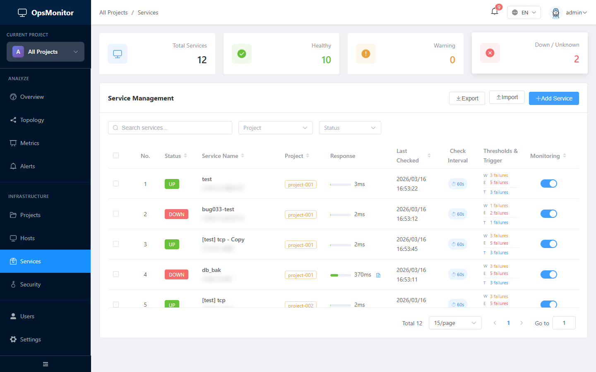

**Step 5** — 返回首页（Dashboard），查看服务健康状态总览

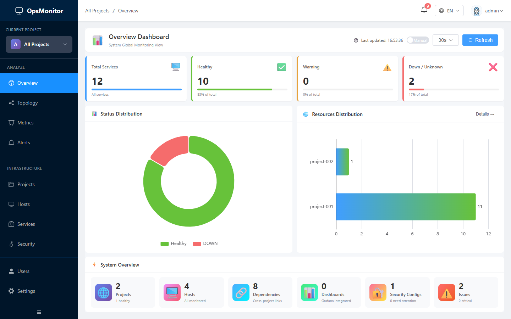

---

## 第四章：用户认证

### 4.1 登录

访问系统首页（`http://localhost:5173`）会自动跳转至登录页面。


**默认管理员账号**：

| 字段 | 值 |
|------|----|
| 用户名 | `admin` |
| 密码 | `admin123` |

> ⚠️ **安全提示**：首次登录后请立即修改默认密码！

输入账号密码后点击 **Sign In** 按钮完成登录：

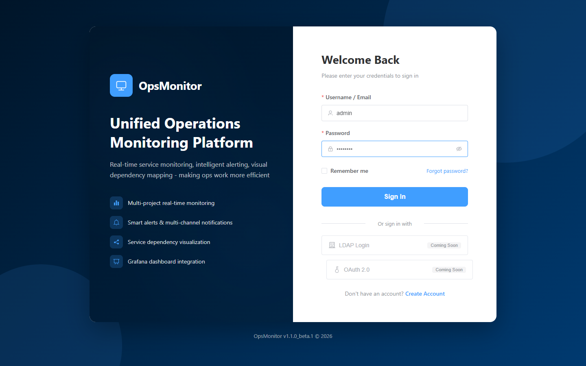

### 4.2 注册新账号

点击登录页面底部的 **Create Account** 链接进入注册页面，填写用户名、邮箱和密码后提交。

> 注意：新注册用户默认角色为 **Viewer（观察者）**，仅拥有只读权限。需管理员在 [第十五章 用户管理](#第十五章用户管理仅管理员) 中手动提升权限。

### 4.3 SSO 登录（即将推出）

登录页面下方展示了两种 SSO（单点登录）选项，目前尚在开发中：

| 方式 | 状态 |
|------|------|
| **LDAP Login** | Coming Soon |
| **OAuth 2.0** | Coming Soon |

### 4.4 修改密码与个人信息

登录后，点击**右上角用户头像/用户名**，在下拉菜单中可以：
- 修改个人资料（用户名、邮箱）
- 修改密码
- 退出登录（Logout）

### 4.5 退出登录

点击右上角用户菜单 → **Logout** 即可安全退出，系统会清除本地 Token 并跳转回登录页面。

### 4.6 语言切换

系统支持 **中文（简体）** 和 **English** 两种界面语言，可随时切换。

**切换方式**：

1. 点击页面右上角的语言切换按钮（显示为 “中文” 或 “EN”）
2. 在下拉菜单中选择目标语言
3. 界面将立即切换为所选语言

**语言偏好规则**：

| 场景 | 行为 |
|------|------|
| 首次访问 | 自动检测浏览器语言，中文浏览器默认为中文，其他默认为 English |
| 手动切换后 | 将语言偏好保存至本地存储，下次访问自动应用 |
| 告警通知 | 语言偏好会同步至后端，邮件和 Teams 告警通知将使用相同语言发送 |

---

## 第五章：概览仪表盘

**页面路径**：`/`（系统首页）

概览仪表盘是系统的全局监控入口，汇总展示所有服务的实时健康状态。


### 5.1 统计卡片

页面顶部展示四个统计卡片：

| 卡片 | 说明 |
|------|------|
| **Total Services** | 当前项目（或全部项目）的服务总数 |
| **Healthy** | 状态为 UP 的服务数量 |
| **Warning** | 状态为 WARNING 的服务数量 |
| **Down** | 状态为 DOWN/UNKNOWN 的服务数量 |

每张卡片下方附有进度条，直观展示各状态的占比。

### 5.2 图表展示

统计卡片下方展示两个图表卡片以及系统概览区域：

| 图表 | 说明 |
|------|------|
| **状态分布饼图** | 展示 UP / WARNING / DOWN / UNKNOWN 各状态的服务占比 |
| **项目服务柱状图** | 按项目分组展示各项目的服务数量 |
| **系统概览** | 项目数、主机数、依赖数、Grafana 仪表板数、安全配置数、问题数的快速统计 |

### 5.3 自动刷新与手动刷新

页面右上角提供刷新控制区域：

| 控件 | 说明 |
|------|------|
| **Auto / Manual 开关** | 开启/关闭自动刷新 |
| **间隔下拉菜单** | 可选 15秒 / 30秒 / 1分钟 / 5分钟 |
| **倒计时进度条** | 展示距下次刷新的剩余时间 |
| **Refresh 按钮** | 立即手动刷新 |

### 5.4 按项目筛选

通过页面**左侧导航菜单顶部的项目选择器**，可切换查看特定项目的监控数据。选择项目后，仪表盘上的所有统计数据将自动过滤为该项目范围内的数据。

---

## 第六章：项目管理

**页面路径**：`/projects`

**导航入口**：左侧导航栏 **INFRASTRUCTURE** 组 → **Projects**

项目是服务的逻辑分组，用于组织和隔离不同业务或环境的监控服务。


### 6.1 创建项目

有三种方式可以创建新项目：

**方式一：通过 Projects 页面顶部按钮（推荐）**

1. 点击左侧导航栏 **INFRASTRUCTURE → Projects** 进入项目列表页
2. 点击页面右上角 **New Project** 按钮
3. 在弹出对话框中填写：

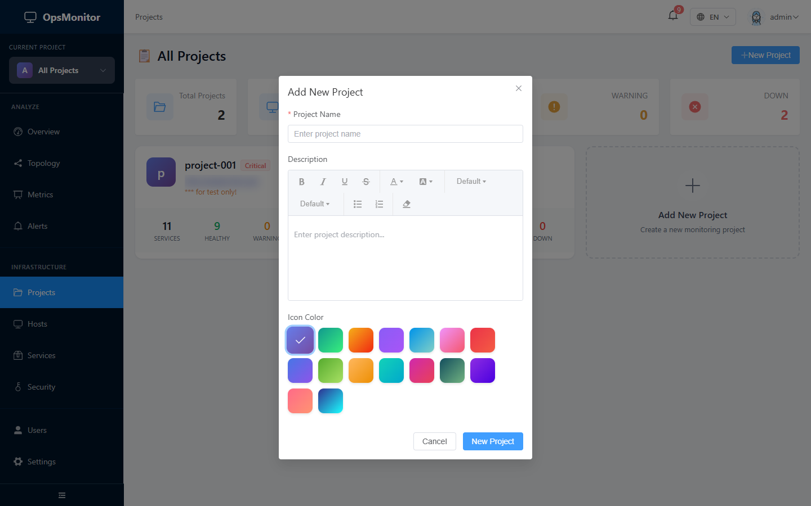

   - **项目名称**（必填）：如 "生产环境"、"测试环境"
   - **描述**（选填）：项目的详细说明
   - **颜色主题**：为项目卡片选择显示颜色
4. 点击 **Create Project** 保存

**方式二：通过项目列表页的添加卡片**

在项目列表的最后一格有一张 **Add New Project** 卡片，直接点击即可触发新建对话框（与方式一效果相同）。

**方式三：通过侧边栏 Current Project 下拉选择器**

1. 点击左侧导航菜单顶部的 **Current Project** 下拉选择器
2. 在展开的下拉菜单中点击 **New Project**

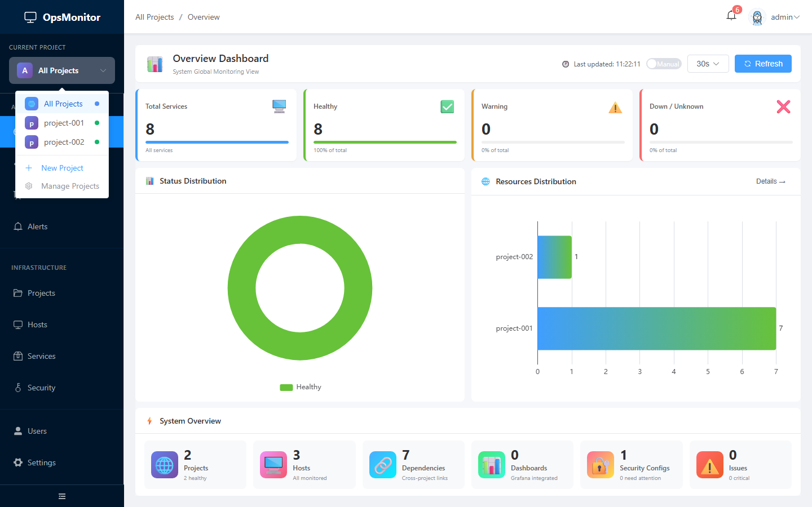

3. 填写项目信息后点击 **Create Project** 保存

### 6.2 编辑项目

1. 鼠标悬停在项目卡片上，点击右上角 **"..."** 菜单
2. 选择 **Edit**
3. 修改项目信息后保存

### 6.3 删除项目

1. 点击项目卡片右上角 **"..."** 菜单
2. 选择 **Delete**
3. 在确认弹窗中确认删除

> ⚠️ 删除项目**不会**删除项目内关联的主机和服务，它们会变为未分配状态。

### 6.4 项目切换与数据过滤

- 点击任意项目卡片，可将该项目设为当前上下文
- 切换后，仪表盘、服务列表等页面将自动过滤显示该项目的数据
- 左侧侧边栏顶部的 **Current Project** 下拉选择器也可快速切换

**Current Project 下拉选择器说明：**

| 选项 | 说明 |
|------|------|
| **All Projects** | 切换至全局视图，显示所有项目数据 |
| 各项目名称 | 切换至该项目上下文，右侧彩色小圆点表示项目健康状态（🟢 健康 / 🟡 警告 / 🔴 故障） |
| **New Project** | 跳转到 Projects 页面并弹出新建对话框 |
| **Manage Projects** | 跳转到 Projects 页面进行项目管理 |

---

## 第七章：主机管理

**页面路径**：`/hosts`

主机是监控目标的物理/虚拟载体，OpsMonitor 支持两种连接模式：
- **SSH 模式**：用于远程服务器，通过 SSH 执行检查命令
- **Local 模式**：用于本地网络可达的目标，通过直接 TCP/HTTP 访问进行检查


### 7.1 视图模式

| 模式 | 说明 |
|------|------|
| **卡片视图** | 以卡片形式展示主机，直观显示连接状态和服务健康统计 |
| **表格视图** | 以表格形式展示，便于对比查看多台主机的信息 |

点击页面右上角的视图切换图标即可在两种模式间切换。

### 7.2 添加主机

点击 **Add Host** 按钮，打开添加主机对话框：

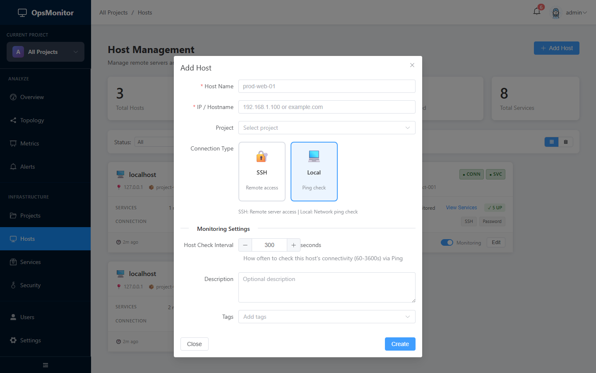

**基本信息**：

| 字段 | 必填 | 说明 |
|------|------|------|
| Host Name | ✅ | 主机的显示名称，如 `prod-web-01` |
| IP / Hostname | ✅ | 服务器的 IP 地址或域名 |
| Project | — | 关联的项目（可选） |

**连接类型**：

选择 **SSH** 或 **Local**：

- 选择 **Local**：支持基本的网络可达性检查（TCP / HTTP / HTTPS）
- 选择 **SSH**：支持远程命令执行、文件检查等高级功能

**SSH 配置**（选择 SSH 时显示）：

| 字段 | 说明 |
|------|------|
| SSH Port | SSH 端口，默认 22 |
| Username | SSH 登录用户名 |
| Auth Type | 认证方式：Password（密码）或 Private Key（私钥） |
| Password / Private Key | 对应的认证凭据 |
| Proxy Host | 跳板机主机名（可选，用于跳板机场景） |

**高级参数**（可折叠展开）：

| 字段 | 默认值 | 说明 |
|------|--------|------|
| Max Retries | 3 | 连接失败后的重试次数（1-10） |
| Retry Delay | 1s | 重试间隔时长（1-10 秒） |
| Connection Timeout | 10s | SSH 握手超时时间（5-60 秒） |
| Command Timeout | 30s | 远程命令执行超时时间（10-300 秒） |

**监控参数**：

| 字段 | 默认值 | 说明 |
|------|--------|------|
| Host Check Interval | — | 主机连通性检查间隔（60-3600 秒），SSH 模式通过 SSH 连接检测，Local 模式通过 Ping 检测 |

**其他字段**：

| 字段 | 说明 |
|------|------|
| Description | 主机描述信息（选填） |
| Tags | 标签，用于主机分类和筛选 |

### 7.3 跳板机（Proxy Host）配置

当目标服务器无法直接访问，需通过跳板机中转时：

1. 在 **Proxy Host** 字段填写跳板机主机名（需已在系统中将该跳板机作为主机添加）
2. 系统将通过 SSH 隧道经跳板机连接到目标服务器

### 7.4 测试连接

在添加/编辑主机对话框中提供 **Connection Test** 功能：
- **SSH 模式**：点击 **🔌 Test SSH Connection** 按钮，系统将尝试建立 SSH 连接并返回结果
- **Local 模式**：点击 **📡 Test Ping** 按钮，系统将执行 Ping 测试

> 连接测试通常需要 5-15 秒，请耐心等待。

### 7.5 主机状态说明

| 状态标签 | 颜色 | 含义 |
|---------|------|------|
| CONN OK | 🟢 绿色 | 最近一次连接测试成功 |
| CONN FAIL | 🔴 红色 | 最近一次连接测试失败 |
| SVC OK | 🟢 绿色 | 该主机下所有服务均正常 |
| SVC WARN | 🟠 橙色 | 该主机下有服务处于警告状态 |
| SVC ERROR | 🔴 红色 | 该主机下有服务处于故障状态 |
| SVC — | 灰色 | 该主机下尚未配置任何服务 |

### 7.6 编辑与删除主机

- **编辑**：点击主机卡片的 **Edit** 按钮，或在表格视图中点击编辑图标
- **删除**：点击 **Delete** 按钮，确认后删除

> 删除主机前请确保该主机下无正在运行的监控服务，否则相关服务的检查将失败。

---

## 第八章：服务管理

**页面路径**：`/services`

服务是 OpsMonitor 中监控的最小单元，每个服务对应一个具体的健康检查目标。


### 8.1 服务的概念

| 概念 | 说明 |
|------|------|
| **服务（Service）** | 一个健康检查项，关联到特定主机上的一种检查任务 |
| **检查类型** | 定义如何检查：TCP 连通性、HTTP 响应、文件存在性等 |
| **风险级别** | 标记服务的重要程度：Low / Medium / High / Critical |
| **调度** | 定义检查频率和时间范围 |

### 8.2 使用向导添加服务

点击 **Add Service** 按钮，启动添加服务向导（分多步引导完成配置）：

**Step 1 — 基本信息**

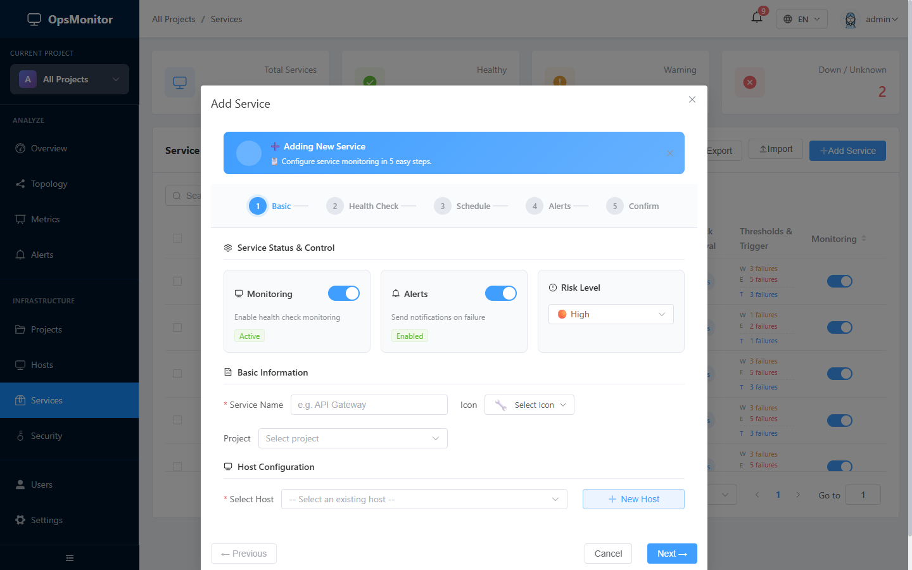

| 字段 | 必填 | 说明 |
|------|------|------|
| Service Name | ✅ | 服务的显示名称，如 `api-gateway-https` |
| Project | — | 关联的项目 |
| Monitoring | — | 是否启用监控（开关，默认开启） |
| Alerts | — | 是否启用告警通知（开关） |
| Risk Level | — | 风险级别：Low / Medium / High / Critical |

**Step 2 — 主机与检查配置**

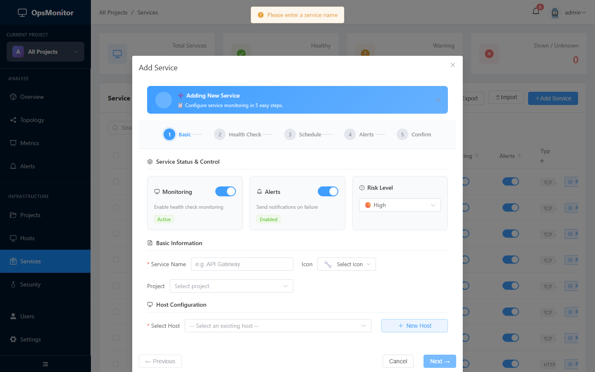

- 从下拉菜单选择已有主机，或点击 **+ New Host** 直接在向导中新建
- 选择检查类型后，页面会动态展示对应的配置字段

### 8.3 健康检查类型配置

**TCP 检查**：
- 配置字段：**Port**（必填）
- 说明：验证目标主机指定端口是否开放并可接受连接

**HTTP 检查**：
- 配置字段：**Port**、**Path**（如 `/health`）、**Expected Status Code**（如 `200`）、**Timeout**
- 说明：发送 HTTP GET 请求，验证响应状态码

**HTTPS 检查**：
- 配置字段：同 HTTP，另支持 SSL 证书验证
- 说明：通过 HTTPS 协议检查，可同时验证 SSL/TLS 证书有效性

**Script 脚本检查**：

| 字段 | 说明 |
|------|------|
| Script Type | 脚本类型：bash / python / powershell / nodejs |
| Script Content | 脚本内容（多行编辑器） |
| Expected Exit Code | 期望的退出码，默认为 `0`（表示成功） |

示例 — 检查磁盘使用率：

```bash
#!/bin/bash
USAGE=$(df / | awk 'NR==2 {print $5}' | tr -d '%')
[ "$USAGE" -lt 90 ] && exit 0 || exit 1
```

**File Monitor 文件监控**：

| 字段 | 说明 |
|------|------|
| Mode | **Single File**（单文件）或 **Folder + Pattern**（目录+匹配模式） |
| File Path | 单文件模式下的文件完整路径 |
| Directory Path | 目录模式下的目录路径 |
| Filename Pattern | 文件名匹配模式，支持 glob（如 `*.log`）和正则（如 `app-.*\.log`） |

> 💡 **高级选项**：创建服务后通过**编辑服务**可配置完整的文件检查参数：
> - **Check Type**：`exists`（存在性）/ `size`（大小）/ `modified`（修改时间）/ `content`（内容匹配）
> - **Max Age**：文件的最大允许年龄（支持分钟/小时/天三种单位）
> - **Content Pattern**：内容匹配的正则表达式
> - **Min Size**：文件最小大小（KB）
> - **Freshness Window**：文件新鲜度窗口期（天）
> - **Use Latest Matched File**：目录模式下自动选择最新匹配文件

**数据库检查（即将推出）**：

向导的检查类型选择器中还展示了即将推出的数据库检查类型，目前标记为 Coming Soon 尚不可用：

| 类型 | 说明 |
|------|------|
| 🐬 MySQL Check | MySQL 数据库连通性检查 |
| 🐘 PostgreSQL Check | PostgreSQL 数据库连通性检查 |
| 📮 Redis Check | Redis 缓存服务检查 |
| 🍃 MongoDB Check | MongoDB 数据库连通性检查 |

### 8.4 告警阈值配置

| 字段 | 范围 | 说明 |
|------|------|------|
| **Warning Threshold** | 1-30 | 连续检查失败达到该次数后，服务状态变为 WARNING |
| **Error Threshold** | 1-50 | 连续检查失败达到该次数后，服务状态变为 DOWN |
| **Alert Trigger Threshold** | 1-10 | 连续失败达到该次数后才发送告警通知，避免网络抖动产生误报 |

> 示例：Warning = 2，Error = 5，Alert Trigger = 3 → 连续失败 2 次进入警告，连续失败 5 次标记为 DOWN，连续失败 3 次后发送告警通知

### 8.5 依赖配置

在服务创建或编辑时，可在 **Dependencies** 区域添加服务间的依赖关系：
1. 点击 **Add Dependency**
2. 搜索并选择被依赖的服务
3. 设置**依赖类型**（在系统设置中可自定义）和**风险级别**
4. 依赖关系将反映在[依赖拓扑图](#第十章依赖拓扑图)中

### 8.6 编辑服务

点击服务列表中的 **Edit** 按钮，打开完整的服务编辑表单：

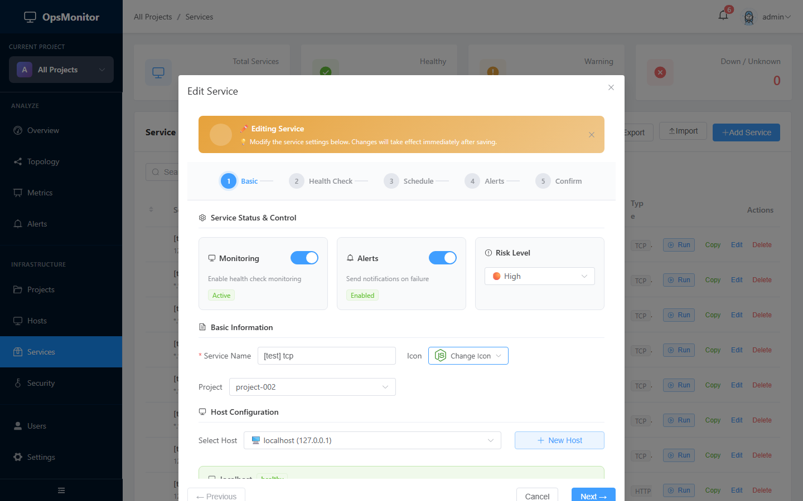

编辑表单包含比添加向导更全面的配置选项，包括：
- 完整的检查参数配置
- 调度配置（详见 [第九章](#第九章调度配置)）
- 告警自定义内容：
  - **Service Impact Description**：描述服务故障时的影响
  - **Custom Alert Template**：自定义告警消息模板，支持变量：`{service_name}`, `{host}`, `{port}`, `{risk_level}`, `{down_time}`, `{impact_description}`

### 8.7 批量操作

在服务列表页面，勾选多个服务后，顶部会出现批量操作工具栏：

| 操作 | 说明 |
|------|------|
| **Batch Edit** | 批量修改检查间隔、告警阈值、风险级别等配置 |
| **Delete** | 批量删除选中服务 |
| **Clear** | 清除当前选择 |

### 8.8 导入 / 导出服务配置

服务列表页面提供配置的导入导出功能：

- **Export**：将当前所有服务配置导出为 JSON 文件，用于备份或环境迁移
- **Import**：从 JSON 文件中批量导入服务配置

### 8.9 手动触发健康检查

在服务列表中，点击某服务行的**运行按钮（▶）**，可立即触发一次健康检查，无需等待下一个调度周期。检查结果会实时更新到页面。

### 8.10 服务状态说明

| 状态 | 颜色 | 含义 |
|------|------|------|
| **UP** | 🟢 绿色 | 服务正常，最近检查成功 |
| **WARNING** | 🟠 橙色 | 连续失败次数达到 Warning 阈值 |
| **DOWN** | 🔴 红色 | 连续失败次数达到 Error 阈值 |
| **UNKNOWN** | 灰色 | 尚未执行检查，或监控已禁用 |

---

## 第九章：调度配置

每个服务支持独立的检查调度配置，可覆盖系统全局默认间隔。

### 9.1 两种调度方式

#### 固定间隔（Fixed Interval）

最简单直接的调度方式，每隔固定时长执行一次检查：

| 配置项 | 说明 |
|--------|------|
| 间隔时长 | 支持快捷选项（30s / 1min / 5min / 10min / 30min / 1h） |
| 单位切换 | 可在秒（Seconds）、分钟（Minutes）、小时（Hours）之间切换输入 |

示例：设置为 300 秒 → 每 5 分钟检查一次。

#### 时间规则（Time Rules）

通过添加多条时间规则，实现在不同时间段使用不同间隔进行检查：

| 配置项 | 说明 |
|--------|------|
| **星期** | 选择规则生效的星期几（可多选） |
| **时间范围** | 设置每天的起止时间（如 09:00 - 18:00） |
| **检查间隔** | 该时间段内的检查频率（秒） |

**典型场景**：

| 时间段 | 星期 | 间隔 | 目的 |
|--------|------|------|------|
| 09:00 - 18:00 | 周一至周五 | 60s | 工作时间高频检查 |
| 18:00 - 09:00 | 周一至周五 | 600s | 夜间低频检查，减少噪音 |
| 全天 | 周六、周日 | 1800s | 周末值班低频检查 |

> 💡 当时间规则列表为空时，系统自动切回固定间隔模式。

### 9.2 执行预览

调度配置面板底部提供 **Execution Preview（执行预览）** 功能，实时展示调度效果：

| 信息项 | 说明 |
|--------|------|
| **Current Time** | 当前系统时间 |
| **Current Range** | 当前匹配的时间规则名称 |
| **Current Interval** | 当前使用的检查间隔 |
| **Next Run** | 下一次预计执行检查的时间 |

预览区域还包含 **Execution Plan (Next 24 Hours)** 时间线，以可视化方式展示未来 24 小时内各时间段的检查计划和检查间隔。

### 9.3 配置入口

| 入口 | 说明 |
|------|------|
| 服务编辑表单 → 调度配置面板 | 为单个服务独立配置调度 |
| 系统设置 → Default Check Interval | 设定新服务的默认固定间隔 |

---

## 第十章：依赖拓扑图

**页面路径**：`/graph`

依赖拓扑图以可视化方式展示项目内所有服务及其相互依赖关系，支持实时影响分析。

> ⚠️ 需先通过左侧菜单**选择一个项目**，才能加载该项目的拓扑图。

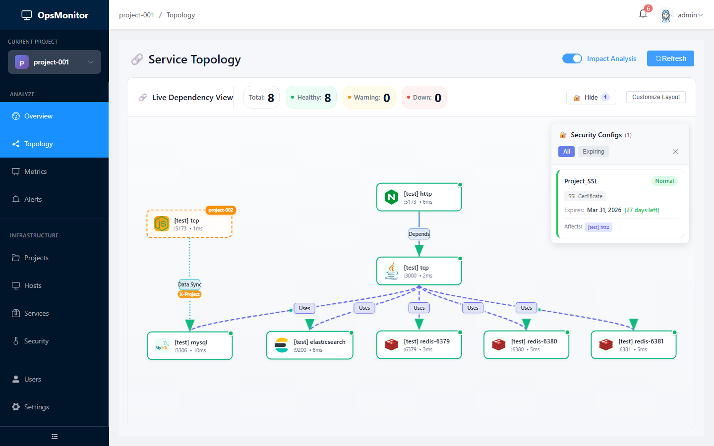

### 10.1 基础操作

| 操作 | 方式 |
|------|------|
| **拖拽节点** | 鼠标按住节点拖动，重新排布布局 |
| **缩放画布** | 鼠标滚轮缩放，或使用控件按钮 |
| **平移画布** | 鼠标按住空白区域拖动 |
| **查看服务详情** | 点击节点，右侧面板展示服务状态和检查信息 |
| **重置布局** | 点击 Reset Layout 按钮恢复自动布局 |

### 10.2 节点与连线含义

**节点颜色**（代表服务健康状态）：

| 颜色 | 状态 |
|------|------|
| 🟢 绿色 | UP（正常） |
| 🟠 橙色 | WARNING（警告） |
| 🔴 红色 | DOWN（故障） |
| 灰色 | UNKNOWN（未知） |

**连线颜色**（代表依赖链状态）：

| 颜色 | 含义 |
|------|------|
| 蓝色/灰色 | 正常依赖 |
| 红色/橙色 | 依赖链上存在故障服务 |

箭头方向表示依赖方向：A → B 表示 A 依赖 B（B 是 A 的上游）。

### 10.3 影响分析（Impact Analysis）

开启页面顶部的 **Impact Analysis** 开关后，当存在 DOWN/WARNING 状态的服务时，系统会：

1. 高亮显示故障服务节点
2. 追踪所有**依赖于该服务的下游服务**
3. 在右侧面板列出：
   - 故障服务详情
   - 受影响服务清单
   - 按风险级别（Critical / High / Medium / Low）分类的影响统计

### 10.4 安全面板

拓扑图右侧的**安全面板**展示：
- 该项目关联的安全配置状态
- 即将过期（30天内）的凭证提醒，方便运维人员及时处理

---

## 第十一章：告警配置

**页面路径**：`/alerts`

告警配置页面用于设置通知渠道（邮件 / Teams）以及查看历史告警记录。

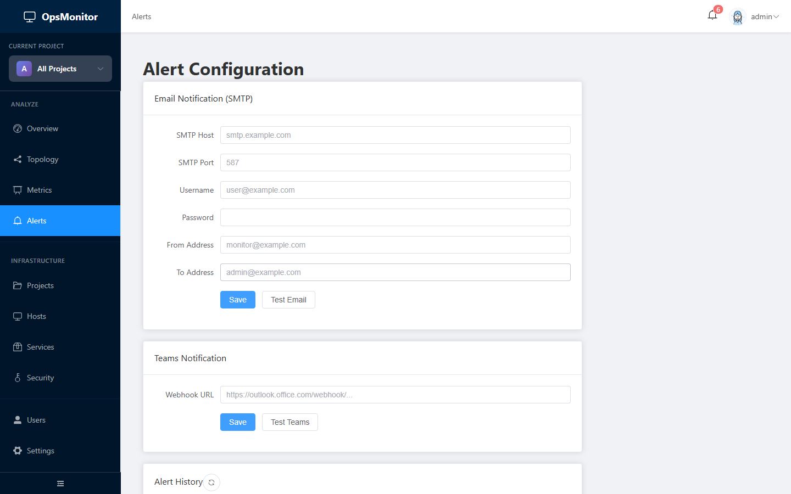

### 11.1 邮件通知（SMTP）

在 **Email (SMTP)** 配置卡片中填写以下信息：

| 配置项 | 示例 | 说明 |
|--------|------|------|
| SMTP Host | `smtp.office365.com` | SMTP 服务器地址 |
| SMTP Port | `587` | SMTP 端口（TLS 通常 587，SSL 通常 465） |
| Username | `monitor@company.com` | SMTP 登录用户名 |
| Password | `********` | SMTP 登录密码 |
| From Address | `monitor@company.com` | 发件人邮件地址 |
| To Address | `ops-team@company.com` | 收件人邮件地址（多个用逗号分隔） |

配置完成后，点击 **Test Email** 按钮发送测试邮件以验证配置是否正确。

### 11.2 Teams Webhook 通知

在 **Microsoft Teams** 配置卡片中填写：

| 配置项 | 说明 |
|--------|------|
| Webhook URL | 在 Teams 频道中创建 Incoming Webhook 后获得的 URL |

配置完成后，点击 **Test Teams** 按钮发送测试通知。

> **获取 Teams Webhook URL 步骤**：
> 1. 在 Teams 中打开目标频道
> 2. 点击频道名旁的 "..." → 管理频道 → 连接器
> 3. 找到 "Incoming Webhook" 并配置，复制生成的 URL

### 11.3 告警触发逻辑

| 事件 | 触发条件 | 通知内容 |
|------|---------|---------|
| **警告** | 连续失败次数 ≥ Warning Threshold | 服务进入 WARNING 状态通知 |
| **故障** | 连续失败次数 ≥ Error Threshold | 服务进入 DOWN 状态通知 |
| **恢复** | 服务从故障状态恢复为 UP | 恢复通知 |

> 服务级别的 **Alerts** 开关必须开启，该服务的告警通知才会发送。

### 11.4 告警历史记录

页面下方的 **Alert History** 卡片展示所有历史告警，包含以下字段：

| 字段 | 说明 |
|------|------|
| Time | 告警发生时间 |
| Service | 触发告警的服务名称 |
| Type | 告警类型（warning / error / recovery） |
| Message | 告警详细内容 |
| Notified | 是否已成功发送通知 |

---

## 第十二章：安全配置

**页面路径**：`/security`

安全配置模块用于集中管理各类凭证和证书的过期时间，在即将过期时主动预警。

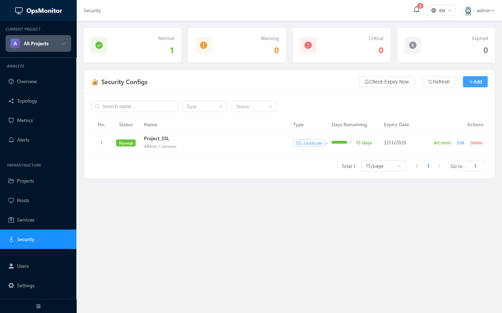

### 12.1 支持的配置类型

| 类型 | 说明 |
|------|------|
| **AccessKey** | API 访问密钥（如云服务 AK/SK） |
| **Password** | 各类密码凭证，用途由用户自定义描述（如数据库密码、FTP 密码等） |
| **SSL Certificate** | SSL/TLS 证书 |

### 12.2 添加安全配置

1. 点击页面右上角 **Add** 按钮
2. 填写配置信息：
   - **Name**（必填）：配置的显示名称，如 `aws-prod-access-key`
   - **Type**（必填）：选择配置类型（AccessKey / Password / SSL Certificate）
   - **Validity Period**：有效期天数（默认 60 天）
   - **Expiry Date**（必填）：过期日期
   - **Reminder Rules**：提醒规则，可勾选提前 7 天 / 3 天 / 1 天提醒
   - **Affected Services**：关联受影响的服务（按项目分组选择）
   - **Notes**（选填）：备注说明
3. 点击保存

### 12.3 过期状态说明

系统根据剩余有效期自动计算并显示状态：

| 状态 | 颜色 | 触发条件 |
|------|------|---------|
| **Normal** | 🟢 绿色 | 距过期日期超过 30 天 |
| **Warning** | 🟠 橙色 | 距过期日期 ≤ 30 天 |
| **Critical** | 🔴 红色 | 距过期日期 ≤ 7 天 |
| **Expired** | 灰色 | 已超过过期日期 |

页面顶部的四个统计卡片汇总各状态（Normal / Warning / Critical / Expired）的数量，便于快速全局评估。

### 12.4 手动触发过期检查

点击页面右上角的 **Check Expiry Now** 按钮，系统将立即对所有安全配置执行一次过期检查，并向已配置的通知渠道发送即将过期的提醒消息。

### 12.5 其他页面操作

| 操作 | 说明 |
|------|------|
| **Type 筛选** | 按配置类型过滤列表（AccessKey / FTP Password / SSL Certificate） |
| **Status 筛选** | 按到期状态过滤列表（Normal / Warning / Critical / Expired） |
| **搜索** | 按名称关键词搜索 |
| **Extend（延期）** | 快速延长有效期：在弹出的 **Confirm Extension** 对话框中输入延期天数即可 |
| **Edit** | 修改配置详情 |
| **Delete** | 删除配置记录 |

---

## 第十三章：Grafana 集成

**页面路径**：`/grafana`

Grafana 集成功能允许将外部 Grafana 仪表板嵌入到 OpsMonitor 界面中，实现统一的监控视图。

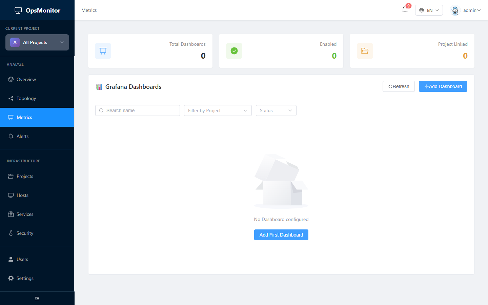

### 13.1 添加 Grafana 仪表板

1. 点击 **Add Dashboard** 按钮
2. 填写 Grafana 连接信息：
   - **Grafana URL**：Grafana 服务器地址，如 `http://grafana.company.com:3000`
   - **API Key**（可选）：若 Grafana 仪表板需要认证，填入 API Key
3. 点击 **Test Connection** 测试连通性
4. 连接成功后，从下拉菜单中选择要嵌入的 Dashboard
5. 填写其他信息：
   - **Dashboard Name**：在 OpsMonitor 中的显示名称
   - **Project**：关联的项目
   - **Panel ID**（可选）：指定嵌入特定面板而非整个 Dashboard
6. **嵌入选项**：
   - 主题（Light / Dark）
   - 自动刷新间隔
   - 是否隐藏顶部导航栏

### 13.2 查看 Grafana 仪表板

在 Grafana 列表中，每条记录提供以下操作：

| 按钮 | 说明 |
|------|------|
| **View** | 在当前页面弹窗中以 iframe 形式嵌入展示 |
| **Open Original** | 在新标签页中打开原始 Grafana 页面 |
| **Edit** | 修改嵌入配置 |
| **Delete** | 移除该集成配置 |

---

## 第十四章：系统设置（仅管理员）

**页面路径**：`/settings`

系统设置页面用于配置全局参数，**仅管理员可修改**，Viewer 角色仅可查看当前配置。

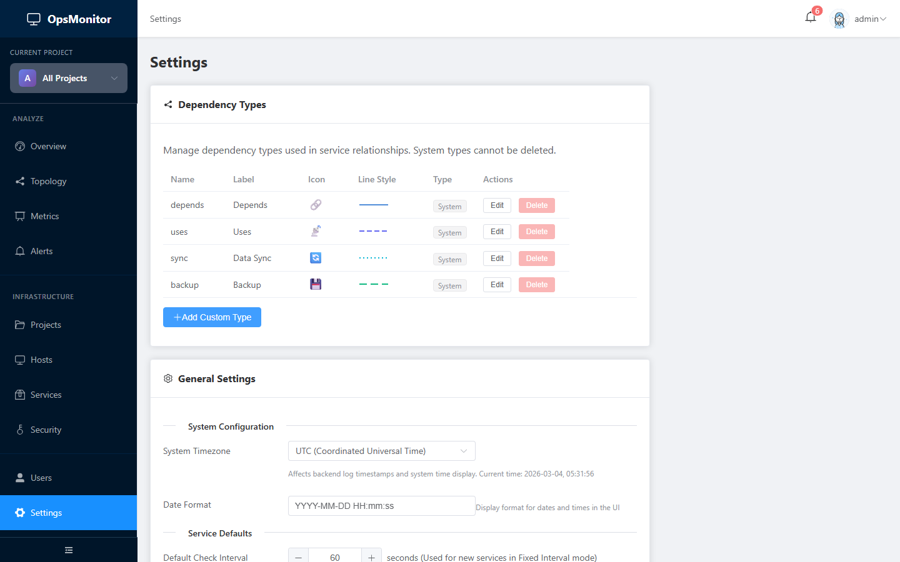

### 14.1 系统时区与日期格式

| 配置项 | 说明 |
|--------|------|
| **System Timezone** | 系统时区，影响后端日志时间戳和界面时间显示。支持常用时区，包括 UTC、Asia/Shanghai 等 |
| **Date Format** | 日期时间的显示格式，默认 `YYYY-MM-DD HH:mm:ss` |

修改时区后，页面会显示当前时区下的实时时间以供确认。

### 14.2 服务默认配置

新建服务时使用的全局默认值，可被服务级别的独立配置覆盖：

| 配置项 | 说明 |
|--------|------|
| **Default Check Interval** | 默认检查间隔（秒），新服务在固定间隔模式下使用此值 |
| **Default Warning Threshold** | 默认警告阈值（连续失败次数，范围 1-30） |
| **Default Error Threshold** | 默认错误阈值（连续失败次数，范围 1-50） |

### 14.3 数据管理

| 配置项 | 说明 |
|--------|------|
| **Log Retention Days** | 后端日志的保留天数，超期日志将自动清理 |
| **Data Retention Days** | 健康检查记录在数据库中的保留天数，超期数据将自动清理以节省存储 |
| **Export Config** | 导出所有服务配置为 JSON 文件（用于备份或环境迁移） |
| **Import Config** | 从 JSON 文件批量导入服务配置 |

### 14.4 依赖类型管理

系统预置了若干依赖类型（如"强依赖"、"弱依赖"），管理员还可以**自定义依赖类型**：

1. 查看现有依赖类型列表，包含名称、标签、图标、线条样式等属性
2. 点击 **Add Custom Type** 创建新的依赖类型，配置名称、图标和颜色
3. **系统内置类型**（System）不可删除，自定义类型可编辑和删除

### 14.5 通知配置（全局）

全局通知配置用于设置系统级别的邮件 SMTP 和 Teams Webhook，与[告警配置页面](#第十一章告警配置)共享同一套通知渠道配置。

---

## 第十五章：用户管理（仅管理员）

**页面路径**：`/users`

用户管理页面供管理员查看和管理系统内所有账号，**仅管理员角色可访问此页面**。

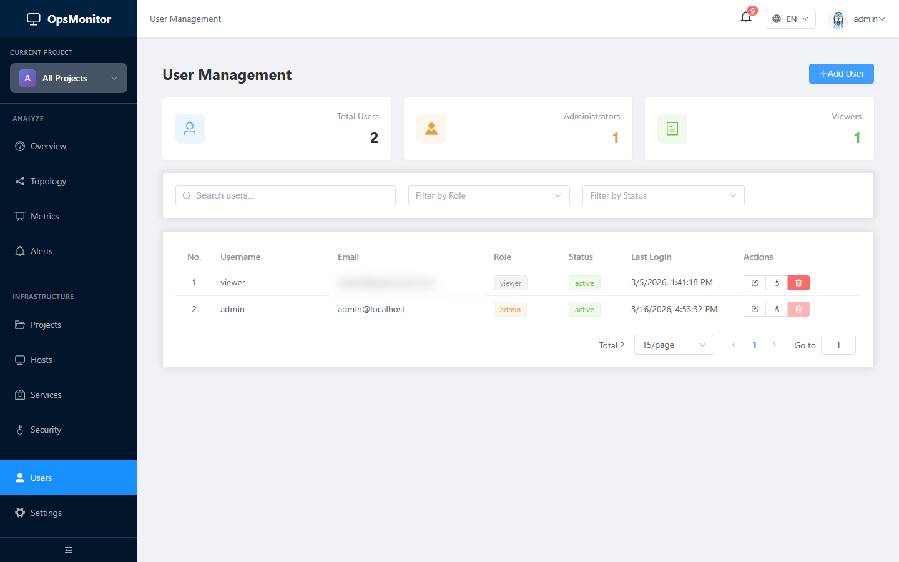

### 15.1 用户列表

页面顶部展示三个统计卡片：**Total Users**（用户总数）、**Administrators**（管理员数）、**Viewers**（观察者数）。

支持按关键字搜索用户，以及通过 **Role**（Admin / Viewer）和 **Status**（Active / Inactive）筛选。

表格展示所有注册用户的信息：

| 字段 | 说明 |
|------|------|
| No. | 序号 |
| Username | 用户名 |
| Email | 邮箱地址 |
| Role | 角色（Admin / Viewer） |
| Status | 账号状态（Active / Inactive） |
| Last Login | 最后登录时间 |
| Actions | 操作按钮 |

### 15.2 添加用户

点击页面右上角 **Add User** 按钮，在弹出对话框中填写用户名、邮箱、密码和角色后创建。

### 15.3 修改用户角色与状态

1. 在用户列表中找到目标用户
2. 点击 **Actions** 列的编辑按钮
3. 在编辑对话框中修改角色（Admin / Viewer）或状态（Active / Inactive）
4. 权限变更**立即生效**，该用户下次操作时将使用新权限

### 15.4 重置密码

1. 在用户列表中找到目标用户
2. 点击 **Actions** 列的钥匙图标按钮
3. 在 **Reset Password** 对话框中输入新密码和确认密码
4. 点击 **Reset Password** 完成重置

### 15.5 删除用户

点击用户行末尾的 **Delete** 按钮，在确认弹窗中确认后删除该账号。

> ⚠️ **限制**：
> - 管理员无法删除自己的账号
> - 删除操作不可撤销，账号下的历史数据将一并清除

---

## 第十六章：健康检查类型参考

### 16.1 本地检查类型

以下检查类型从监控服务器直接发起，不经过 SSH：

| 检查类型 | 适用主机 | 主要配置参数 | 说明 |
|---------|---------|------------|------|
| **TCP** | Local / SSH | 主机、端口 | 验证端口是否开放并可接受连接 |
| **HTTP** | Local / SSH | 主机、端口、路径、期望状态码、超时 | 发送 HTTP GET 请求验证响应 |
| **HTTPS** | Local / SSH | 同 HTTP，含 SSL 验证 | 支持 TLS/SSL 证书有效性检查 |
| **Script** | Local / SSH | 脚本类型、脚本内容、期望退出码 | 在监控服务器本地执行自定义脚本 |
| **File Monitor** | 需配置 SSH | 模式、路径、检查类型、最大年龄等 | 通过 SSH 在目标主机执行文件检查 |
| **Log Monitor** | 需配置 SSH | 模式、路径、内容匹配模式 | 通过 SSH 监控日志文件内容变化 |

### 16.2 SSH 远程检查类型

以下检查类型通过 SSH 连接到目标主机后，在目标主机上执行（主机须配置 SSH 连接）：

| 检查类型 | 主要配置参数 | 说明 |
|---------|------------|------|
| **file-exists** | 文件路径 | 检查目标主机上指定文件是否存在 |
| **file-age** | 文件路径、最大年龄（秒） | 检查文件修改时间，确保文件足够新鲜 |
| **command** | 命令内容、期望输出匹配模式 | 在目标主机执行任意命令，验证退出码或输出内容 |

### 16.3 混合模式检查

对于 HTTP/HTTPS 和 TCP 检查，支持两种访问模式：

| 模式 | 说明 | 适用场景 |
|------|------|---------|
| **直接访问** | 监控服务器直接连接到目标地址 | 目标服务对监控网络直接可达 |
| **SSH 代理** | 通过 SSH 连接到主机，在主机内网中执行检查 | 目标服务在防火墙内，仅对主机本机可达 |

---

## 第十七章：典型使用场景

### 场景一：监控 Web 应用（HTTPS 检查）

**目标**：检查生产环境 Web 服务是否正常响应

**配置步骤**：
1. 创建项目 "Production-Web"
2. 添加主机（IP：`10.0.1.10`，连接类型：Local）
3. 添加服务：
   - Check Type: **HTTPS**
   - Port: `443`
   - Path: `/health`
   - Expected Status Code: `200`
   - Warning Threshold: `2`，Error Threshold: `5`

---

### 场景二：监控数据库服务（TCP 检查）

**目标**：检查数据库端口是否开放，确认服务存活

**配置步骤**：
1. 添加主机（数据库服务器，可为 Local 或 SSH 模式）
2. 添加服务：
   - Check Type: **TCP**
   - Port: `3306`（MySQL）或 `5432`（PostgreSQL）或 `1433`（MSSQL）

---

### 场景三：监控定时任务输出（File Age 检查）

**目标**：确保每小时的数据处理任务正常产出文件（文件不超过 1 小时未更新）

**配置步骤**：
1. 添加主机（任务服务器，SSH 连接）
2. 添加服务：
   - Check Type: **File Monitor**
   - Mode: Single File
   - File Path: `/var/data/job-output/result.csv`
   - Check Type（高级选项）: `modified`
   - Max Age: `3600`（秒）

若文件超过 1 小时未更新，服务状态将变为 WARNING/DOWN。

---

### 场景四：监控磁盘使用率（Script 检查）

**目标**：检查服务器磁盘使用率是否低于 90%

**配置步骤**：
1. 添加主机（目标服务器，SSH 连接）
2. 添加服务：
   - Check Type: **Script**
   - Script Type: `bash`
   - Expected Exit Code: `0`
   - 脚本内容：

```bash
#!/bin/bash
USAGE=$(df / | awk 'NR==2 {print $5}' | tr -d '%')
if [ "$USAGE" -lt 90 ]; then
  echo "Disk usage: ${USAGE}% - OK"
  exit 0
else
  echo "Disk usage: ${USAGE}% - CRITICAL"
  exit 1
fi
```

---

### 场景五：跨环境服务依赖影响分析

**目标**：微服务架构下，某服务故障时快速识别受影响的上游服务

**配置步骤**：
1. 在各服务的编辑页面 **Dependencies** 区域，配置服务间的依赖关系
2. 进入**依赖拓扑图**（`/graph`）并开启 **Impact Analysis**
3. 当某服务变为 DOWN 状态时，系统自动高亮并列出所有受影响的下游服务

---

## 第十八章：常见问题与故障排查

### Q1：无法登录系统

**可能原因**：
- 账号或密码错误
- 后端服务未启动

**解决方案**：
1. 确认使用正确的账号密码（默认：`admin` / `admin123`）
2. 访问 `http://localhost:3000/health` 确认后端服务是否正常运行
3. 查看后端日志排查具体错误

---

### Q2：服务状态一直显示 UNKNOWN

**可能原因**：
- 服务的 **Monitoring** 开关未开启
- 尚未到达下一个调度周期
- 后端健康检查服务异常

**解决方案**：
1. 进入服务编辑，确认 **Monitoring** 开关已开启（蓝色）
2. 点击服务行的手动执行按钮（▶）立即触发一次检查
3. 检查后端服务是否正常运行

---

### Q3：SSH 连接测试失败

**可能原因**：
- IP / 端口配置错误
- 用户名或密码/私钥不正确
- 目标服务器防火墙阻止 SSH 访问
- SSH 服务未在目标主机上运行

**解决方案**：
1. 核对主机 IP 和 SSH 端口（默认 22）
2. 确认用户名和认证凭据（密码或私钥）正确
3. 检查服务器防火墙是否开放 22 端口
4. 从本地命令行手动验证：`ssh user@host -p port`

---

### Q4：告警通知未收到

**可能原因**：
- 告警渠道配置错误（SMTP / Webhook URL）
- 服务的 **Alerts** 开关未开启
- 邮件被过滤到垃圾邮件箱

**解决方案**：
1. 在[告警配置页面](#第十一章告警配置)使用 **Test Email** / **Test Teams** 验证配置
2. 确认触发告警的服务已开启 **Alerts** 开关
3. 检查收件人的垃圾邮件文件夹

---

### Q5：端口被占用（启动失败）

**错误信息**：`EADDRINUSE: address already in use :::3000`

**解决方案**：

```powershell
# Windows — 查找并结束占用 3000 端口的进程
netstat -ano | findstr :3000
taskkill /PID <上方显示的PID> /F
```

```bash
# Linux / macOS
lsof -i :3000
kill -9 <PID>
```

---

### Q6：依赖图加载缓慢或无法显示

**可能原因**：
- 未选择项目（必须先在左侧菜单选择项目）
- 单个项目服务数量过多

**解决方案**：
1. 确认左侧菜单已选择一个具体项目
2. 若服务数量超过 50+，考虑拆分项目以减少单图节点数
3. 刷新页面后重试

---

### Q7：导入服务配置失败

**可能原因**：
- JSON 文件格式不正确（非系统导出格式）
- 导入的服务关联了不存在的主机或项目

**解决方案**：
1. 确认 JSON 文件是由本系统 **Export** 功能导出的标准格式
2. 在导入目标环境中提前创建所需的项目和主机
3. 查看浏览器控制台或后端日志中的具体错误信息

---

### Q8：一台主机上监控服务过多，会导致目标服务器 SSH 线程飙升吗？

系统内置了 SSH 连接池来控制连接数，但实际连接数取决于配置方式。

**连接池机制**：

1. **每池硬限制 3 连接**：连接池按 `host:port@username` 唯一键划分，每个池最多 3 个并发连接。超出的请求进入优先级队列排队等待。
2. **连接复用**：SSH 连接执行完检查命令后立即归还池中，下一个排队请求直接复用，无需重新握手。
3. **调度错峰**：SSH 主机的首次检查间隔 10 秒依次启动，避免启动时的连接风暴。
4. **空闲自动回收**：空闲超过 1 分钟的连接自动关闭（每 30 秒清理一次），不会长期占用目标服务器资源。

**为什么可能看到超过 3 个连接？**

连接池的隔离单元是 **凭据组合**（`host:port@username`），而非物理服务器。以下场景会在同一台服务器上创建多个独立连接池：

| 场景 | 连接池数 | 最大连接数 |
|------|---------|-----------|
| 同一服务器、同一用户名 | 1 个池 | 3 |
| 同一服务器、2 个不同用户名 | 2 个池 | 6 |
| 同一服务器、3 个不同用户名 | 3 个池 | 9 |
| 经同一跳板机的 N 台目标主机 | N 个池 | N × 3（跳板机侧） |

**常见的多连接池情况**：
- **主机心跳**使用 hosts 表的凭据（如 `admin@server`），**SSH 类型服务检查**使用 security_configs 表的凭据（如 `deploy@server`）—— 用户名不同则产生两个独立池（最多 6 连接）。
- 多台主机经过**同一跳板机**时，跳板机上会累积所有目标主机的代理连接。

**优化建议**：
- 尽量对同一台服务器使用**统一的 SSH 用户名**，减少连接池数量。
- 对跳板机后的大量主机，关注跳板机的 SSH 最大连接数配置（`MaxSessions`、`MaxStartups`）。

---

## 附录 A：API 接口速查表

| 方法 | 接口路径 | 说明 |
|------|---------|------|
| POST | `/api/auth/login` | 用户登录，返回 JWT Token |
| POST | `/api/auth/register` | 用户注册 |
| GET | `/api/auth/me` | 获取当前登录用户信息 |
| GET/POST/PUT/DELETE | `/api/users` | 用户管理（仅 Admin） |
| GET/POST/PUT/DELETE | `/api/projects` | 项目管理 |
| GET | `/api/projects/:id/graph` | 获取项目依赖图数据 |
| GET/POST/PUT/DELETE | `/api/hosts` | 主机管理 |
| POST | `/api/hosts/:id/test-connection` | 测试主机 SSH 连接 |
| POST | `/api/hosts/test-all` | 批量测试所有主机连接 |
| GET/POST/PUT/DELETE | `/api/services` | 服务管理 |
| GET | `/api/services/export` | 导出所有服务配置（JSON） |
| POST | `/api/services/import` | 导入服务配置 |
| PUT | `/api/services/:id/schedule` | 更新服务调度配置 |
| GET | `/api/checks/latest` | 获取最新健康检查记录 |
| GET | `/api/checks/events` | SSE 实时检查结果推送 |
| POST | `/api/checks/:id/run` | 手动触发健康检查 |
| GET | `/api/checks/:id/history` | 获取检查历史记录 |
| GET | `/api/checks/stats/summary` | 获取检查统计摘要 |
| GET/POST/PUT/DELETE | `/api/dependencies` | 依赖关系管理 |
| GET | `/api/dependencies/cross-project` | 获取跨项目依赖 |
| GET/POST/PUT/DELETE | `/api/dependency-types` | 依赖类型管理 |
| GET | `/api/alerts` | 获取告警历史记录 |
| GET | `/api/alerts/unacknowledged/count` | 获取未确认告警数量 |
| GET/PUT | `/api/config/notifications` | 通知渠道配置 |
| PUT | `/api/config/notification-lang` | 设置通知语言偏好 |
| POST | `/api/config/notifications/test` | 发送测试通知 |
| GET/POST/PUT/DELETE | `/api/security-configs` | 安全配置管理 |
| GET | `/api/security-configs/check/expiring` | 获取即将过期的安全配置 |
| GET/POST/PUT/DELETE | `/api/grafana-dashboards` | Grafana 仪表板管理 |
| GET | `/api/system-settings` | 获取所有系统设置 |
| GET/PUT | `/api/system-settings/:key` | 获取或更新指定系统设置 |
| GET | `/api/ssh/pool-stats` | SSH 连接池状态 |
| GET | `/api/schedule/templates` | 获取调度模板列表 |
| POST | `/api/schedule/preview` | 预览调度执行时间 |
| POST | `/api/schedule/validate` | 验证调度配置 |

---

## 附录 B：快捷键说明

| 快捷键 | 功能 |
|--------|------|
| `ESC` | 关闭当前弹窗或对话框 |
| `Ctrl + R` | 刷新当前页面数据 |

---